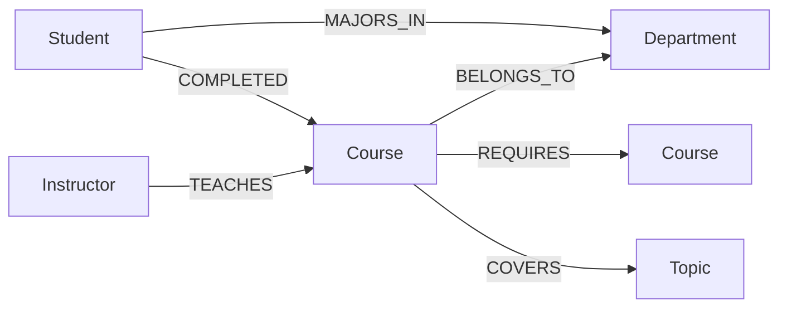
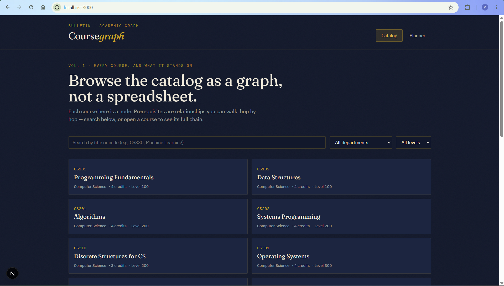
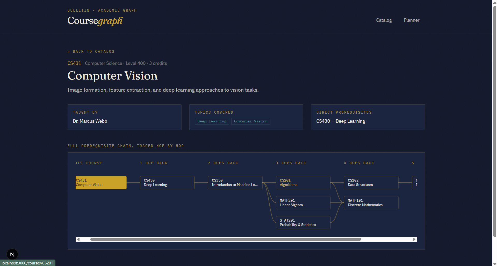
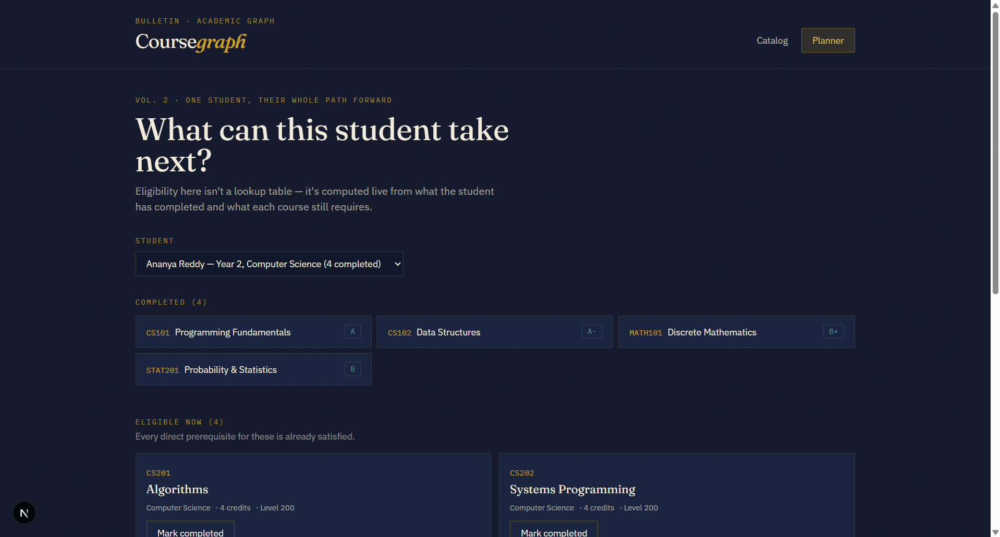
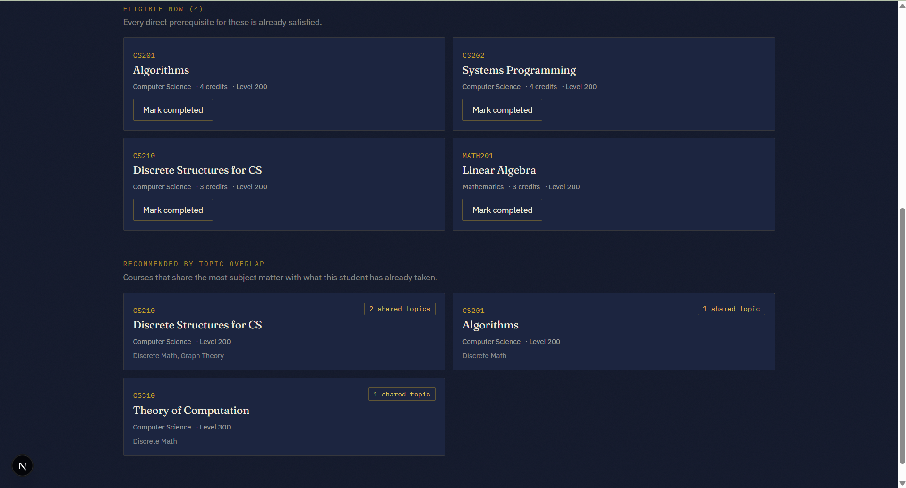

# Coursegraph — Course & Prerequisite Planner

A small full-stack app for exploring a university course catalog as what it actually is: a graph.
Built for the Wexa AI take-home assignment, backed by **CognoDB**.

- **Catalog** — search and filter every course in the curriculum.
- **Course detail** — see a course's direct prerequisites, the courses that build on it, and its
  full prerequisite chain rendered as a diagram (a multi-hop graph traversal).
- **Planner** — pick a student and see, computed live from the graph: what they've completed,
  what they're eligible to take right now, and what's recommended based on topic overlap with
  courses they've already taken.

## Why a graph database?

A course catalog _looks_ like a relational problem until you ask the questions people actually
have:

- **"Everything I need before I can take CS431"** is a variable-depth chain — it might be 1 hop
  or 5, and you don't know which until you walk it. In SQL this needs a recursive CTE that
  re-joins the `prerequisites` table against itself at every depth. In Cypher it's one pattern:
  `(c:Course)-[:REQUIRES*1..6]->(ancestor:Course)`.
- **"What can this student take next?"** means: for every course they haven't taken, check that
  _all_ of its prerequisites are already in their completed set. That's a per-course aggregate
  join with a `HAVING COUNT(*) = (total prereqs)` in SQL — awkward, and it gets worse the moment
  a course has a mix of required and elective prerequisite groups. In Cypher it's a single `ALL()`
  predicate over a pattern comprehension:
  `WHERE ALL(p IN [(c)-[:REQUIRES]->(p) | p] WHERE (s)-[:COMPLETED]->(p))`.
- **Recommendations by shared topics** is a graph proximity question — "courses two hops away
  through a topic in common" — which is natural to express as a traversal and expensive to express
  as a chain of joins once the topic-to-course mapping is many-to-many (which it is here).
- The domain is also just _shaped_ like a graph: courses reference courses, students accumulate
  relationships to courses over time, and the interesting queries are almost all about reachability
  and connection strength rather than aggregation over flat rows. A relational schema can model
  this, but every interesting query fights the schema instead of matching it.

## Data model



**Nodes**
| Label | Key properties |
|---|---|
| `Course` | `code` (unique), `title`, `credits`, `level`, `description` |
| `Department` | `name` (unique) |
| `Topic` | `name` (unique) |
| `Instructor` | `name`, `title` |
| `Student` | `studentId` (unique), `name`, `year`, `major` |

**Relationships**
| Relationship | Direction | Meaning |
|---|---|---|
| `(:Course)-[:REQUIRES]->(:Course)` | course → its prerequisite | direct prerequisite edge; chains traverse this |
| `(:Course)-[:BELONGS_TO]->(:Department)` | course → department | |
| `(:Course)-[:COVERS]->(:Topic)` | course → topic | many-to-many, drives recommendations |
| `(:Instructor)-[:TEACHES]->(:Course)` | instructor → course | |
| `(:Student)-[:COMPLETED {grade, term}]->(:Course)` | student → course | edge properties carry grade/term |
| `(:Student)-[:MAJORS_IN]->(:Department)` | student → department | |

The seed data models a 22-course CS/Math/Stats curriculum (`scripts/seed.mjs`) — real prerequisite
structure (e.g. `CS431` Computer Vision requires `CS430` Deep Learning requires `CS330` Intro ML
requires `CS201`+`MATH201`+`STAT201`), 20 topics, 6 instructors, and 5 students at different points
in the program.

## Setup

### 1. Create a CognoDB instance

1. Go to [console.cognodb.com/signup](https://console.cognodb.com/signup) and create a free
   account (no credit card required).
2. From the console, create a free **c0** instance and pick a region. It provisions in under a
   minute.
3. Copy the connection URI (`bolt+s://<instance-id>.databases.cognodb.cloud`) and the generated
   password for the `cognodb` user — **the password is shown once**, so save it immediately.

### 2. Configure the app

Fill in `.env`:

```
COGNODB_URI=bolt+s://<your-instance-id>.databases.cognodb.cloud
COGNODB_USER=cognodb
COGNODB_PASSWORD=<your-generated-password>
```

### 3. Install dependencies and seed the graph

```bash
npm install
npm run seed
```

`scripts/seed.mjs` clears the graph, creates uniqueness constraints, and loads all courses,
departments, topics, instructors, students, and relationships. It's safe to re-run.

### 4. Run the app

```bash
npm run dev
```

Visit `http://localhost:3000`.

## The main queries, explained

All queries live inline in their API routes under `app/api/`, parameterized via the official
Neo4j JavaScript driver (`neo4j-driver`) — no string-concatenated Cypher anywhere.

**Multi-hop prerequisite chain** (`app/api/courses/[code]/chain/route.js`)

```cypher
MATCH (target:Course {code: $code})
OPTIONAL MATCH path = (target)-[:REQUIRES*1..6]->(ancestor:Course)
```

Walks every `REQUIRES` path up to 6 hops from the target course in one traversal. The API
flattens the returned paths into a deduplicated node/edge list, which `components/PrereqTree.js`
lays out as a leveled diagram — one column per hop back from the target.

**Eligible-now courses for a student** (`app/api/planner/[studentId]/route.js`)

```cypher
MATCH (s:Student {studentId: $studentId})
MATCH (c:Course)
WHERE NOT (s)-[:COMPLETED]->(c)
WITH s, c, [(c)-[:REQUIRES]->(p) | p.code] AS prereqCodes
WHERE ALL(pc IN prereqCodes WHERE (s)-[:COMPLETED]->(:Course {code: pc}))
```

For every course the student hasn't taken, checks that _all_ of its direct prerequisites are
already in the student's completed set — a single pattern-comprehension-plus-`ALL()`, versus the
join-and-count-per-course a relational schema would need.

**Recommendations by topic overlap** (same file)

```cypher
MATCH (s:Student {studentId: $studentId})-[:COMPLETED]->(:Course)-[:COVERS]->(t:Topic)<-[:COVERS]-(rec:Course)
WHERE NOT (s)-[:COMPLETED]->(rec)
WITH rec, count(DISTINCT t) AS overlap, collect(DISTINCT t.name) AS sharedTopics
```

A two-hop traversal from "courses I've taken" through shared topics to "courses I haven't,"
ranked by how many topics overlap.

**Mark a course completed** (`app/api/planner/[studentId]/complete/route.js`) — a parameterized
`MERGE` write that adds/updates a `COMPLETED` edge with grade and term.

## Project structure

```
app/
  page.js                       Catalog (search + filter)
  courses/[code]/page.js        Course detail + prerequisite chain diagram
  planner/page.js                Per-student planner
  api/
    courses/route.js             GET catalog list, with search/filter
    courses/[code]/route.js      GET single course detail
    courses/[code]/chain/route.js GET multi-hop prerequisite chain
    planner/students/route.js    GET student list
    planner/[studentId]/route.js GET completed/eligible/recommended
    planner/[studentId]/complete/route.js  POST mark course completed
    meta/route.js                GET departments/levels for filters
components/                      Shared UI (cards, states, prereq diagram)
lib/neo4j.js                     Driver singleton + typed error handling
scripts/seed.mjs                 Seed script (courses, students, relationships)
```

## Error handling

`lib/neo4j.js` distinguishes a missing/misconfigured connection (`ConfigError`) from an
unreachable database (`DatabaseUnavailableError`). Every API route catches both and returns a
503 with a plain-language message; the UI (`components/ErrorState.js`) surfaces that message
instead of a blank page or stack trace.

## Deployment

Deployed on Vercel's free tier: `https://course-prerequisite-planner.vercel.app/`

## Screenshots

**Catalog** — search and filter across the course list.



**Course detail** — a course's info alongside its full prerequisite chain, traced hop by hop.



**Planner** — a student's completed and eligible-now courses, computed live.



**Planner** — recommended courses by topic overlap, and marking a course complete.


